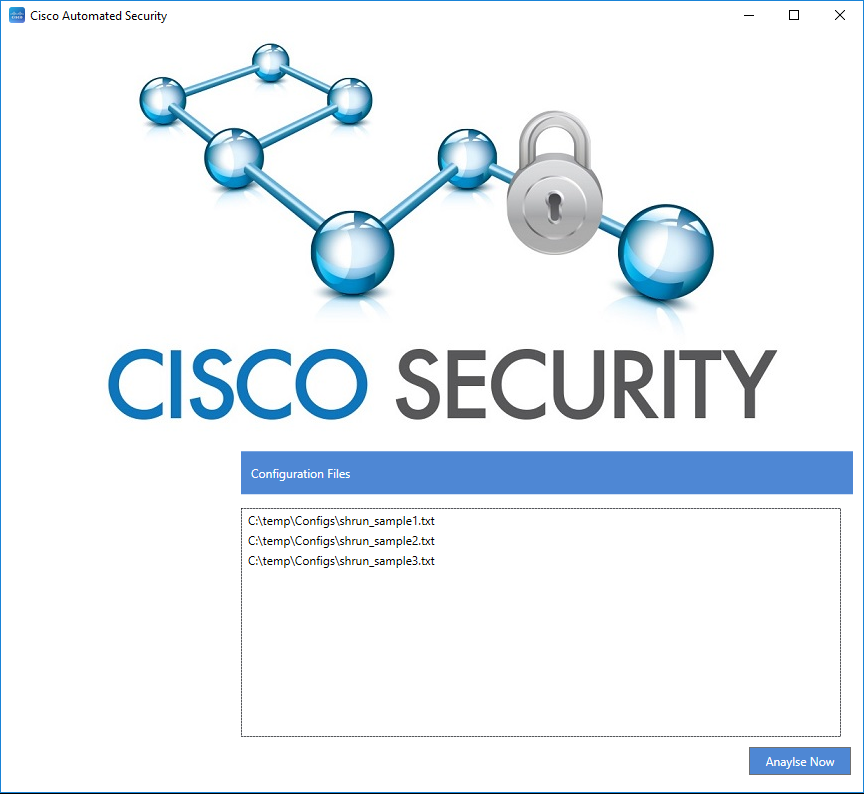

## Cisco Automated Security
Having worked with Cisco products for several years, I was motivated to use my expertise to assist others in securing their routers, switches and firewalls. Many products simply point out configuration flaws - this goes a step further and offers to fix them in a concise, accurate and reliable way, taking into account your environment.

###### Running the tool
You can either download a release, which should run immediately on any Windows machine with .NET installed. Or you can clone the repository and build the source using Visual Studio.

Once running, it's simply a case of browsing to the output of 'show run' from your devices and then clicking on Analyse Now

Once this has run, you will be presented with a results page which will explain the issue, provide evidence and explain how the fix works. The fixes can then be applied and a new running configuration generated.

